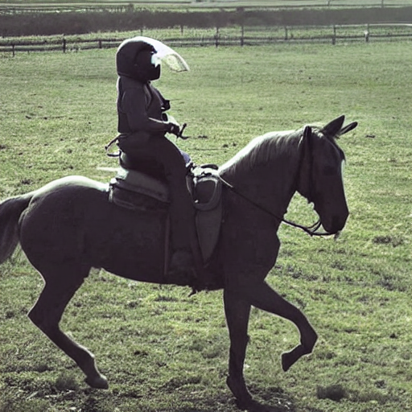

# Proof of Concept - Stable Diffusion in Java

## Introduction

The idea behind this branch is that by tracing pretrained models in HuggingFaces StableDiffusion pipeline we can reimplement the same functionality both in Java and inside DJL. This implementation is only the minimum implementation and would require further work to properly emulate the HuggingFace StableDiffusion pipeline implementation.

## Artifacts

I will not be adding the traced pretrained models to this project, but they can be replicated by getting the stable-diffusion-v1.4 checkpoints, and `torch.jit.trace()` on the models needed. In this example there are 4 models traced from the pipeline as well as a token value dictionary used to mimic the HuggingFace implementation. Additionally, the minimum version of the scheduler is also implemented here.

I have added some example outputs from this example running on the configuration hardcoded into the example.

## Setting Up Locally

First you will need to trace the pretrained models and saved as `.pt` files in `./artifacts`. Specifically, you will need the text encoder, unet, variational autoencoder's `post_quant_conv` and `decoder`. An example of a locally running model that you can use for tracing can be found in `./artifacts/model.py` and `./artifacts/minimum_pipe.py`. Then you will need to create a `vocab_dictionary` to match the tokens from the tokenizer to the numeric values used for the trained models in the HuggingFace StableDiffusion pipeline.
After you have all of the artifacts in your artifacts folder you will need to update the placeholder paths in the `StableDiffusion` class file. Once that is done you can update the static variables to provide different prompts and get different output images. **Note** This is a proof of concept and not many protections are currently reflected in the code, so alter inputs other than the prompt with caution.